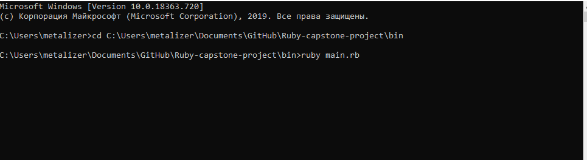
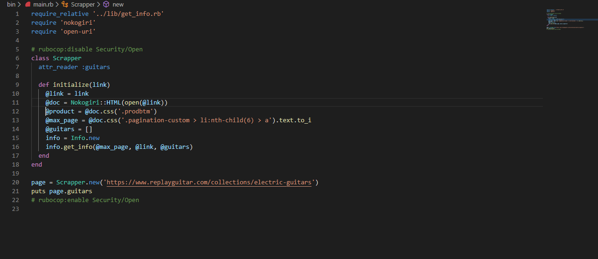
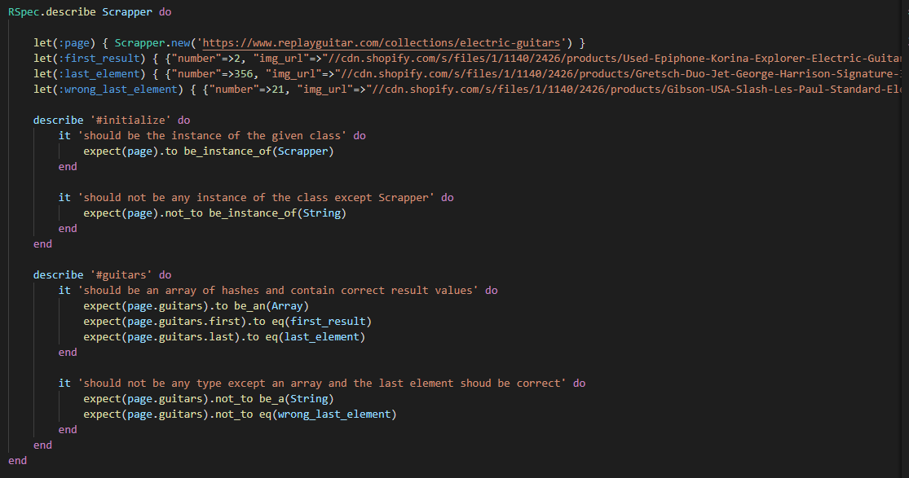

# Ruby-capstone-project
A web scraper.

Web scraping, web harvesting, or web data extraction is data scraping used for extracting data from websites. This Webscrapper collects and stores data of all electric guitars from the guitar shop website(https://www.replayguitar.com/collections/electric-guitars?page=1) inside a txt file.

## Potential future features
- Add user interface
- Add front-end

## Built With
- Ruby
- Nokogiri

Getting Started
- Run a command line
- Go to a root folder
- CD to a bin folder
- Run command "ruby main.rb"


## Screenshots of the code



`````````````````````````````
## Author
👤 Roman Nikolaev

Github: @githubhandle
Twitter: @twitterhandle
Linkedin: linkedin

## Show your support
Give a ⭐️ if you like this project!

## Acknowledgments
Hat tip to Microverse
